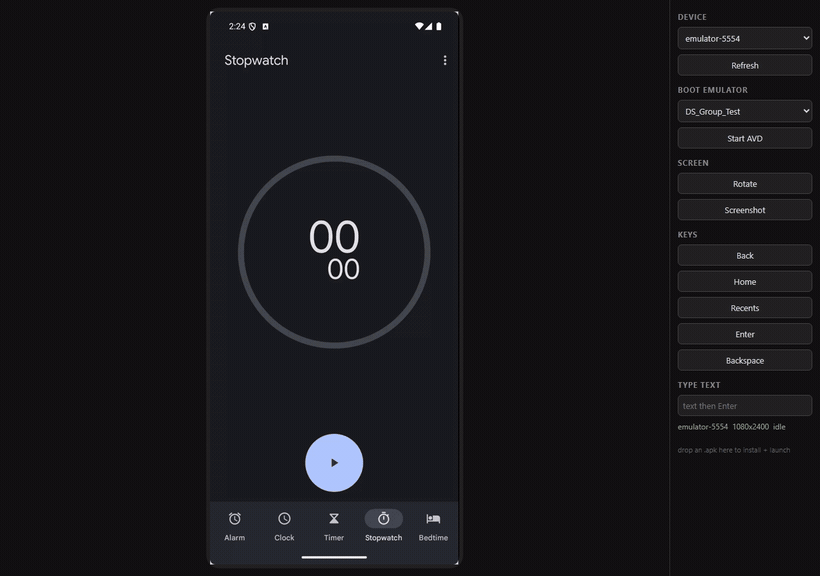
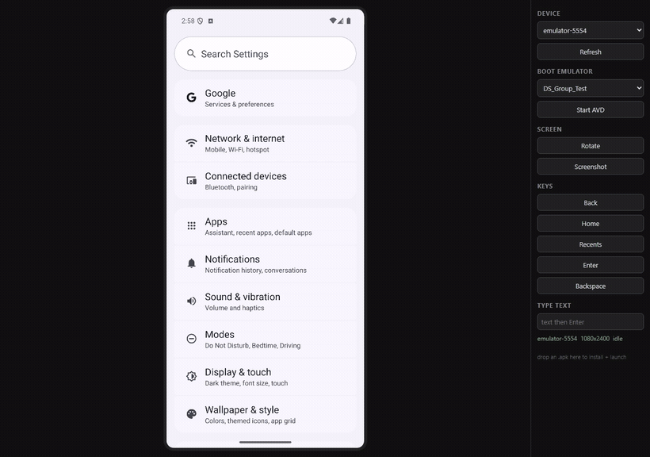

# droidstream

**Stream an Android device into your browser — and let an AI drive it.**

A local, zero-dependency take on the idea behind [Appetize.io](https://appetize.io): your phone or
emulator, live in a web page, tapped and typed by you or by a coding agent. Runs entirely on your
own machine. Ships as a [Claude Code](https://claude.com/claude-code) plugin too.



  

## What it does

- **Live screen** — H.264 via `adb exec-out screenrecord`, decoded in the browser with WebCodecs
  (~15-25 fps under motion). Falls back to a ~1 fps MJPEG stream where WebCodecs is missing.
- **Full input** — click to tap, drag to swipe, type to type, buttons for Back / Home / Recents.
- **Drop an APK on the page** — installs with `adb install -r`, launches it, and confirms it reached the foreground.
- **Rotate and screenshot** buttons; screenshots land in ./screenshots.
- **Boot an emulator** from the AVD dropdown when nothing is attached.
- **HTTP API** so a script or an AI agent can drive the device without a browser.

No npm install. No native modules. One Node file plus one HTML file.

## Drag an APK onto the page

Drop a build anywhere on the window. It uploads, installs with `adb install -r`, launches, and the
status line tells you the package that came up. No `adb` command, no file picker, no terminal.



## Dev builds: the bundler tunnel

A debug build of a React Native, Expo, or Vite app loads its JavaScript from a bundler on your
machine. The device reaches it through `adb reverse`. **`expo start` and `npm run dev` never set
that up** — only `expo run:android` does — so the app sits on its splash screen with no error and
nothing in the log to explain it.

droidstream handles it: after every APK install it checks which bundler ports are actually serving
(`8081`, `19000`, `19001`, `8097`, `5173`, `3000`) and tunnels only those. The status line says
`(tunnel 8081)` when it did. There is a **Tunnel bundler ports** button for the times you started
the bundler after the app, and `POST /reverse {"ports":[8081]}` to do it from a script.

## Requirements

- Android SDK — `platform-tools` (adb) and, for emulators, `emulator`
- Node 18+
- Chrome or Edge for the fast video path

## Run it

```bash
git clone https://github.com/Lokesh-creanno/droidstream
node droidstream/server/server.js
# open http://localhost:8787
```

Environment: `PORT` (default `8787`), `ADB`, `ANDROID_SDK_ROOT`, `ANDROID_SERIAL`.

## Use it as a Claude Code plugin

This repo is also a Claude Code plugin — a `droidstream` skill plus a `/droidstream` command.

```
/plugin install Lokesh-creanno/droidstream
```

Then just ask: *"open my app on the emulator"*, *"install this APK and tap Sign in"*.

## HTTP API

Coordinates are device pixels; read the screen size from `/info`.

| Call | Purpose |
|---|---|
| `GET /info` | device, screen size, device list, AVD list |
| `POST /select` `{serial}` | choose a device |
| `POST /boot` `{avd}` | start an emulator (warm; `{cold:true}` forces a cold boot) |
| `POST /reverse` `{ports}` | `adb reverse` bundler ports back to the host |
| `POST /input` `{type:"tap",x,y}` | tap |
| `POST /input` `{type:"swipe",x1,y1,x2,y2,ms}` | swipe |
| `POST /input` `{type:"text",text}` | type text |
| `POST /input` `{type:"key",key:"KEYCODE_BACK"}` | key event |
| `POST /rotate` | rotate the screen 90 degrees |
| `GET /screenshot` | save a PNG to ./screenshots (add `?download=1` to download it) |
| `GET /frame` | one PNG of the current screen, nothing saved |
| `POST /install` (raw APK body) | install and launch |
| `GET /video` | raw H.264 Annex-B stream |
| `GET /stream` | MJPEG fallback |

```bash
curl -X POST localhost:8787/input -H 'Content-Type: application/json' -d '{"type":"tap","x":540,"y":1200}'
curl -X POST --data-binary @app-debug.apk localhost:8787/install
```

## How the video path works

`screenrecord` writes an Annex-B H.264 elementary stream to stdout. The server pipes it over
chunked HTTP. The page splits NAL units, groups each slice into an access unit, and hands them to
`VideoDecoder`, painting frames on a canvas. No muxer, no MSE, no libraries.

`screenrecord` stops after 180 s, so the server relaunches it while a client is connected. The
encoder emits nothing while the screen is still — the status line reads `idle`, which is normal.

## Making the emulator fast

`POST /boot` and the **Start AVD** button do a warm (snapshot) boot. Do not pass
`-no-snapshot-load` unless you want a cold boot — that flag is the single most common reason an
emulator feels unusably slow, because it rebuilds the whole system image every launch.

Worth setting once on the AVD itself, in Android Studio's Device Manager:

- **Quick Boot** enabled (not Cold Boot)
- **6 CPU cores**
- **Graphics: Hardware — GLES 2.0** (`hw.gpu.mode=host`)

On a tuned Pixel 6 AVD that is roughly **94 s cold versus 33 s warm**.

## When the emulator itself is the problem

- **Tiny emulator window** - the emulator shrinks itself to fit your display. A 1080x2400 AVD on a
  1280x800 laptop panel has nowhere to go. Minimise the window; droidstream scales the screen to
  whatever space the page has.
- **`unauthorized` device, no prompt on screen** — a missing `~/.android/adbkey.pub`.
  `adb kill-server && adb start-server` regenerates the pair.
- **Headless (`{"headless":true}`) exits immediately** — integrated GPUs cannot always make an
  offscreen GL context, so headless boots use the software renderer. Graphics are slower.
- **Slow boots on Windows** - Memory Integrity (Windows Security -> Device security -> Core
  isolation) makes the hypervisor the emulator relies on measurably slower, a Balanced power plan
  throttles the CPU, and Defender scans every write to the multi-gigabyte AVD image.

## Limits

- Android only. iOS needs macOS (`simctl`) and is not implemented yet.
- One device per server instance; start another on a different `PORT` for a second device.
- No audio, no clipboard sync, no pinch/zoom.
- Local use only — the server has no authentication. Do not expose it to a network.

## Test

```bash
node test.js     # needs a device attached
```

## License

MIT
